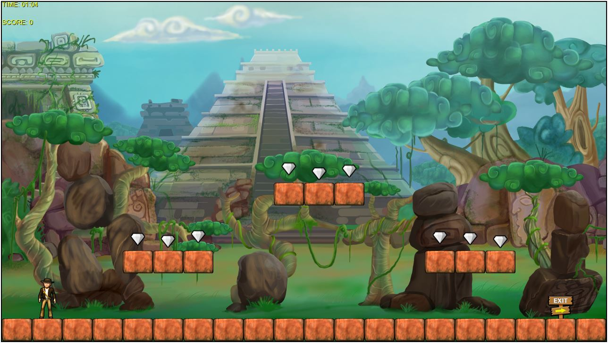

# Platformer-Typescript
Typescript conversion of the XNA Platform example game

This conversion was brought on by the desire to test the C# to Typescript plugin -> "TypescriptSyntaxPaste" for Visual Studio...

I thought this would be a quick project, however I ended up porting a lot of the XNA framework to Typescript at the same time !
The main game code has been left as original as possible, by tweaking the underlying XNA framework to run on the HTML canvas.

A playable demo can be found at : http://ianwigley.co.uk/Platformer/index.html

